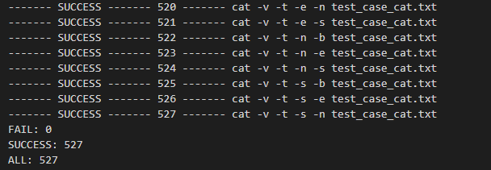

# Simple Bash Utils

Implementation of the functionality of the Unix `cat` and `grep` utilities.

## Cat Utility

The `cat` utility is used to concatenate and display files. It supports the following flags:

- `-b`: Numbers only non-empty lines.
- `-e`: Implies `-v`. (GNU only: `-E` has the same effect, but without implying `-v`)
- `-n` (GNU: `--number`): Numbers all output lines.
- `-s` (GNU: `--squeeze-blank`): Squeezes multiple adjacent blank lines.
- `-t` (GNU: `--with-filename`): Implies `-v`. (GNU: `-T` has the same effect, but without implying `-v`)

## Grep Utility

The `grep` utility is used to search for lines in files that match a given pattern. It supports the following flags:

- `-e pattern`: Specify a pattern to match.
- `-i`: Ignore uppercase vs. lowercase.
- `-v`: Invert match.
- `-c`: Output count of matching lines only.
- `-l`: Output matching files only.
- `-n`: Precede each matching line with a line number.
- `-h`: Output matching lines without preceding them by file names.
- `-s`: Suppress error messages about nonexistent or unreadable files.
- `-f file`: Take regexes from a file.
- `-o`: Output the matched parts of a matching line.

The `cat` and `grep` utilities are tested against their original versions by using a bash script. The script compares the output of the custom implementations with the output of the original utilities for different combinations of flags. Additionally, the leaks in the custom implementations are checked using the Valgrind utility with different flag combinations.

## Usage

To use the `cat` and `grep` utilities, follow these steps:

1. Open a terminal or command prompt.
2. Navigate to the `src/cat` or `src/grep` directory.
3. Run the command `make` to build the project.

After running the `make` command, the project will be built in build folder, and the custom implementations of the `cat` and `grep` utilities will be tested against their original versions.

## Test Output Example

The test output example:

